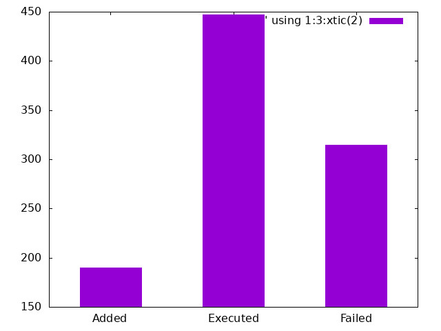

# Too many tasks, not enough speed

Mail processing in 8 threads in parallel.

## Email processing

## Message when main thread finishes

## Output log file

## Generated bar chart of emails

## Received emails

> I used [10 Minute Mail](https://10minutemail.net/) to generate fake emails.

## Author

### [Jeremy Fonseca](https://github.com/fontseca)